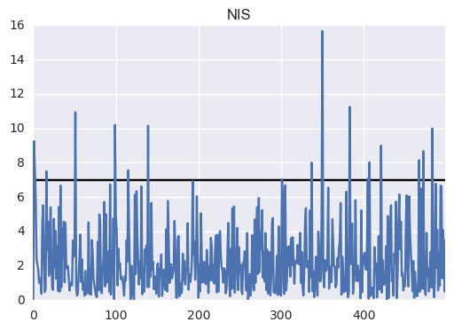

# Unscented Kalman Filter

---

This project implements an unscented kalman filter to track a vehicle using the Constant Turn Rate and Velocity (CTRV) Model. This was done as a project for the udacity self-driving car program.

#####Result RMSE (/data/obj_pose-laser-radar-synthetic-input.txt):
* 0.0635457
* 0.0842665
* 0.304896
* 0.277282

#####Result NIS:

## Dependencies

* cmake >= v3.5
* make >= v4.1
* gcc/g++ >= v5.4

## Basic Build Instructions

1. Clone this repo.
2. Make a build directory: `mkdir build && cd build`
3. Compile: `cmake .. && make`
4. Run it: `./UnscentedKF path/to/input.txt path/to/output.txt`. You can find
   some sample inputs in 'data/'.
    - eg. `./UnscentedKF ../data/obj_pose-laser-radar-synthetic-input.txt`
